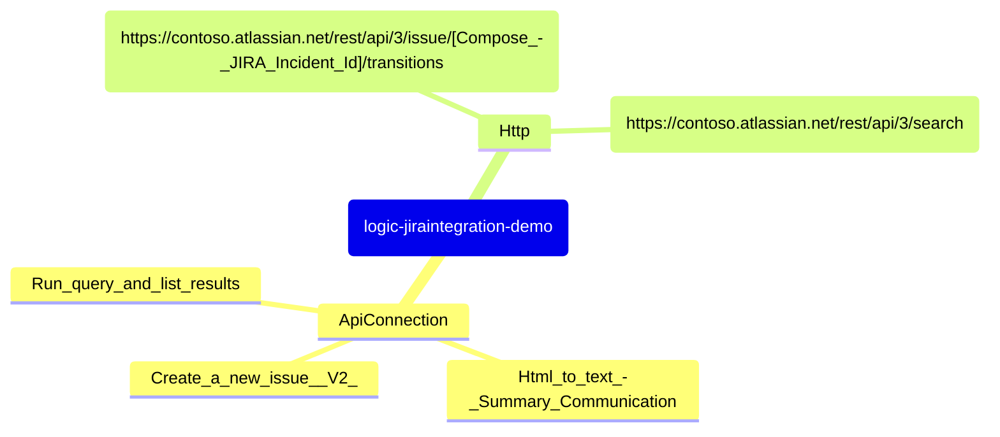
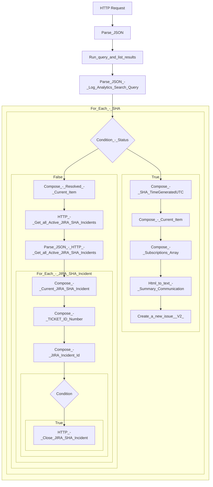

# Azure Logic App Documentation - logic-jiraintegration-demo

## Introduction

This document describes the Azure Logic App Workflow **logic-jiraintegration-demo** in the **jiraintegration-demo-rg** resource group in the **Visual Studio Enterprise** subscription.

This document is programmatically generated using a PowerShell script.

Date: 2025-02-03 11:15:55

## Logic App Call-Out Diagram

## Logic App Workflow Diagram

## Logic App Triggers

This section shows an overview of the Logic App Triggers

### Triggers

| Name | Type | Kind | Method | Schema |
| ---- | ---- | ---- | ------ | ------ |
| HTTP Request | Request | HTTP |  | |

## Logic App Workflow Actions

This section shows an overview of Logic App Workflow actions and their dependencies.

### Actions

| ActionName | Comment | Type | RunAfter | Inputs/Expressions |
| ---------- | ------- | ---- | -------- | ------------------ |
| Condition |  | If | Compose_-_JIRA_Incident_Id | <table><tr><td><pre>{   "and": [     {       "contains": [       "@outputs(\u0027Compose_-_Current_JIRA_SHA_Incident\u0027)[\u0027fields\u0027][\u0027summary\u0027]",       "@items(\u0027For Each - SHA\u0027)[\u0027TICKET_ID_Number\u0027]"       ]     }   ] }</pre></td></tr></table> |
| HTTP_-_Close_JIRA_SHA_Incident |  | Http | Condition | <table><tr><td><pre>{   "body": {     "transition": {       "id": "111"     },     "update": {       "comment": [         {           "add": {             "body": {               "content": [                 {                   "content": [                     {                       "text": "Azure Service Health Alert Incident automatically resolved via Log Analytics Workflow",                       "type": "text"                     }                   ],                   "type": "paragraph"                 }               ],               "type": "doc",               "version": 1             }           }         }       ]     }   },   "headers": {     "Authorization": "Basic ******"   },   "method": "POST", "uri": "https://contoso.atlassian.net/rest/api/3/issue/@{outputs(\u0027Compose_-_JIRA_Incident_Id\u0027)}/transitions" }</pre></td></tr></table> |
| Compose_-_JIRA_Incident_Id |  | Compose | Compose_-_TICKET_ID_Number | <table><tr><td><pre>"@items(\u0027For_Each_-_JIRA_SHA_Incident\u0027)[\u0027id\u0027]"</pre></td></tr></table> |
| Compose_-_TICKET_ID_Number |  | Compose | Compose_-_Current_JIRA_SHA_Incident | <table><tr><td><pre>"@items(\u0027For Each - SHA\u0027)?[\u0027TICKET_ID_Number\u0027]"</pre></td></tr></table> |
| HTTP_-_Get_all_Active_JIRA_SHA_Incidents |  | Http | Compose_-_Resolved_-_Current_Item | <table><tr><td><pre>{   "headers": {     "Authorization": "Basic ******"   },   "method": "GET", "uri": "https://contoso.atlassian.net/rest/api/3/search?jql=Status!=Completed%20and%20cf[10041]~\"Azure\"\u0026fields=key,summary,status,resolution,customfield_10041,description" }</pre></td></tr></table> |
| Parse_JSON |  | ParseJson |  | <table><tr><td><pre>{   "content": "@triggerBody()",   "schema": {     "properties": {       "data": {         "properties": {           "alertContext": {             "properties": {               "condition": {                 "properties": {                   "allOf": {                     "items": {                     "properties": "@{dimensions=; failingPeriods=; linkToFilteredSearchResultsAPI=; linkToFilteredSearchResultsUI=; linkToSearchResultsAPI=; linkToSearchResultsUI=; metricMeasureColumn=; metricValue=; operator=; searchQuery=; targetResourceTypes=; threshold=; timeAggregation=}",                       "required": "searchQuery metricMeasureColumn targetResourceTypes operator threshold timeAggregation dimensions metricValue failingPeriods linkToSearchResultsUI linkToFilteredSearchResultsUI linkToSearchResultsAPI linkToFilteredSearchResultsAPI",                       "type": "object"                     },                     "type": "array"                   },                   "windowEndTime": {                     "type": "string"                   },                   "windowSize": {                     "type": "string"                   },                   "windowStartTime": {                     "type": "string"                   }                 },                 "type": "object"               },               "conditionType": {                 "type": "string"               },               "properties": {                 "properties": {                                    },                 "type": "object"               }             },             "type": "object"           },           "customProperties": {                        },           "essentials": {             "properties": {               "alertContextVersion": {                 "type": "string"               },               "alertId": {                 "type": "string"               },               "alertRule": {                 "type": "string"               },               "alertTargetIDs": {                 "items": {                   "type": "string"                 },                 "type": "array"               },               "configurationItems": {                 "items": {                   "type": "string"                 },                 "type": "array"               },               "description": {                 "type": "string"               },               "essentialsVersion": {                 "type": "string"               },               "firedDateTime": {                 "type": "string"               },               "monitorCondition": {                 "type": "string"               },               "monitoringService": {                 "type": "string"               },               "originAlertId": {                 "type": "string"               },               "severity": {                 "type": "string"               },               "signalType": {                 "type": "string"               }             },             "type": "object"           }         },         "type": "object"       },       "schemaId": {         "type": "string"       }     },     "type": "object"   } }</pre></td></tr></table> |
| Run_query_and_list_results |  | ApiConnection | Parse_JSON | <table><tr><td><pre>{ "body": "@{body(\u0027Parse_JSON\u0027)[\u0027data\u0027][\u0027alertContext\u0027][\u0027Condition\u0027][\u0027allOf\u0027][0][\u0027searchQuery\u0027]}",   "host": {     "connection": {     "name": "@parameters(\u0027$connections\u0027)[\u0027azuremonitorlogs\u0027][\u0027connectionId\u0027]"     }   },   "method": "post",   "path": "/queryData",   "queries": {     "resourcegroups": "la-demo-rg",     "resourcename": "la-demo-workspace",     "resourcetype": "Log Analytics Workspace",     "subscriptions": "fbca04ea-152b-415f-82a4-ae1ffc5f4267",     "timerange": "Last hour"   } }</pre></td></tr></table> |
| Parse_JSON_-_HTTP_-_Get_all_Active_JIRA_SHA_Incidents |  | ParseJson | HTTP_-_Get_all_Active_JIRA_SHA_Incidents | <table><tr><td><pre>{   "content": "@body(\u0027HTTP_-_Get_all_Active_JIRA_SHA_Incidents\u0027)",   "schema": {     "properties": {       "expand": {         "type": "string"       },       "issues": {         "items": {           "properties": {             "expand": {               "type": "string"             },             "fields": {               "properties": {                 "customfield_10041": {                   "type": "string"                 },                 "description": {                   "properties": {                     "content": {                     "items": "@{properties=; required=System.Object[]; type=object}",                       "type": "array"                     },                     "type": {                       "type": "string"                     },                     "version": {                       "type": "integer"                     }                   },                   "type": "object"                 },                 "resolution": {                                    },                 "status": {                   "properties": {                     "description": {                       "type": "string"                     },                     "iconUrl": {                       "type": "string"                     },                     "id": {                       "type": "string"                     },                     "name": {                       "type": "string"                     },                     "self": {                       "type": "string"                     },                     "statusCategory": {                     "properties": "@{colorName=; id=; key=; name=; self=}",                       "type": "object"                     }                   },                   "type": "object"                 },                 "summary": {                   "type": "string"                 }               },               "type": "object"             },             "id": {               "type": "string"             },             "key": {               "type": "string"             },             "self": {               "type": "string"             }           },           "required": [             "expand",             "id",             "self",             "key",             "fields"           ],           "type": "object"         },         "type": "array"       },       "maxResults": {         "type": "integer"       },       "startAt": {         "type": "integer"       },       "total": {         "type": "integer"       }     },     "type": "object"   } }</pre></td></tr></table> |
| Parse_JSON_-_Log_Analytics_Search_Query |  | ParseJson | Run_query_and_list_results | <table><tr><td><pre>{   "content": "@body(\u0027Run_query_and_list_results\u0027)",   "schema": {     "properties": {       "AZURE_SERVICE": {         "type": "string"       },       "IMPACT": {         "type": "string"       },       "JIRA_ASSIGNMENT_GROUP": {         "type": "string"       },       "JIRA_COMPONENT_NAME": {         "type": "string"       },       "SUMMARY_Communication": {         "type": "string"       },       "SUMMARY_Title": {         "type": "string"       },       "Status": {         "type": "string"       },       "Subscriptions": {         "type": "string"       },       "TICKET_ID_Number": {         "type": "string"       },       "TimeGenerated": {         "type": "string"       }     },     "type": "object"   } }</pre></td></tr></table> |
| Compose_-_Current_JIRA_SHA_Incident |  | Compose | For_Each_-_JIRA_SHA_Incident | <table><tr><td><pre>"@items(\u0027For_Each_-_JIRA_SHA_Incident\u0027)"</pre></td></tr></table> |
| Compose_-_Current_Item |  | Compose | Compose_-_SHA_TimeGeneratedUTC | <table><tr><td><pre>"@items(\u0027For Each - SHA\u0027)"</pre></td></tr></table> |
| Compose_-_SHA_TimeGeneratedUTC |  | Compose | Condition_-_Status | <table><tr><td><pre>"@items(\u0027For Each - SHA\u0027)?[\u0027TimeGeneratedUTC\u0027]"</pre></td></tr></table> |
| For_Each_-_SHA |  | Foreach | Parse_JSON_-_Log_Analytics_Search_Query | <table><tr><td><pre>"@body(\u0027Parse JSON - Log Analytics Search Query\u0027)?[\u0027value\u0027]"</pre></td></tr></table> |
| Condition_-_Status |  | If | For_Each_-_SHA | <table><tr><td><pre>{   "and": [     {       "equals": [       "@items(\u0027For Each - SHA\u0027)?[\u0027Status\u0027]",         "Active"       ]     }   ] }</pre></td></tr></table> |
| Compose_-_Subscriptions_Array |  | Compose | Compose_-_Current_Item | <table><tr><td><pre>"@array(items(\u0027For Each - SHA\u0027).Subscriptions)"</pre></td></tr></table> |
| Compose_-_Resolved_-_Current_Item |  | Compose | Condition_-_Status | <table><tr><td><pre>"@items(\u0027For Each - SHA\u0027)"</pre></td></tr></table> |
| For_Each_-_JIRA_SHA_Incident |  | Foreach | Parse_JSON_-_HTTP_-_Get_all_Active_JIRA_SHA_Incidents | <table><tr><td><pre>"@body(\u0027Parse_JSON_-_HTTP_-_Get_all_Active_JIRA_SHA_Incidents\u0027)?[\u0027issues\u0027]"</pre></td></tr></table> |
| Create_a_new_issue__V2_ |  | ApiConnection | Html_to_text_-_Summary_Communication | <table><tr><td><pre>{   "body": {     "fields": {       "customfield_10041": "Azure",     "customfield_10065": "@items(\u0027For Each - SHA\u0027)?[\u0027JIRA_ASSIGNMENT_GROUP\u0027]",     "description": "Azure Service Health Issue\n\nStatus: @{items(\u0027For Each - SHA\u0027)?[\u0027Status\u0027]} \nStart Time: @{items(\u0027For Each - SHA\u0027)?[\u0027TimeGeneratedUTC\u0027]}\nSummary of Impact: @{body(\u0027Html to text - Summary Communication\u0027)}\nTracking ID: @{items(\u0027For Each - SHA\u0027)?[\u0027TICKET_ID_Number\u0027]}\nImpacted Services: @{items(\u0027For Each - SHA\u0027)?[\u0027AZURE_SERVICE\u0027]}\nImpacted Subscriptions: @{items(\u0027For Each - SHA\u0027)?[\u0027Subscriptions\u0027]}",     "summary": "@{items(\u0027For Each - SHA\u0027)?[\u0027SUMMARY_Title\u0027]} - @{items(\u0027For Each - SHA\u0027)?[\u0027TICKET_ID_Number\u0027]}"     }   },   "host": {     "connection": {     "name": "@parameters(\u0027$connections\u0027)[\u0027jira\u0027][\u0027connectionId\u0027]"     }   },   "method": "post",   "path": "/v2/issue",   "queries": {     "issueTypeIds": "10005",     "projectKey": "IP"   } }</pre></td></tr></table> |
| Html_to_text_-_Summary_Communication |  | ApiConnection | Compose_-_Subscriptions_Array | <table><tr><td><pre>{ "body": "\u003cp\u003e@{items(\u0027For Each - SHA\u0027)?[\u0027SUMMARY_Communication\u0027]}\u003c/p\u003e",   "host": {     "connection": {     "name": "@parameters(\u0027$connections\u0027)[\u0027conversionservice\u0027][\u0027connectionId\u0027]"     }   },   "method": "post",   "path": "/html2text" }</pre></td></tr></table> |

## Logic App Connections

This section shows an overview of Logic App Workflow connections.

### Connections

| ConnectionName | ConnectionId | ConnectionProperties |
| -------------- | ------------ | -------------------- |
| azuremonitorlogs | /subscriptions/fbca04ea-152b-415f-82a4-ae1ffc5f4267/resourceGroups/jiraintegration-demo-rg/providers/Microsoft.Web/connections/azuremonitorlogs | <table><tr><td><pre></pre></td></tr></table> |
| conversionservice | /subscriptions/fbca04ea-152b-415f-82a4-ae1ffc5f4267/resourceGroups/jiraintegration-demo-rg/providers/Microsoft.Web/connections/conversionservice | <table><tr><td><pre></pre></td></tr></table> |
| jira-3 | /subscriptions/fbca04ea-152b-415f-82a4-ae1ffc5f4267/resourceGroups/jiraintegration-demo-rg/providers/Microsoft.Web/connections/jira-3 | <table><tr><td><pre></pre></td></tr></table> |
